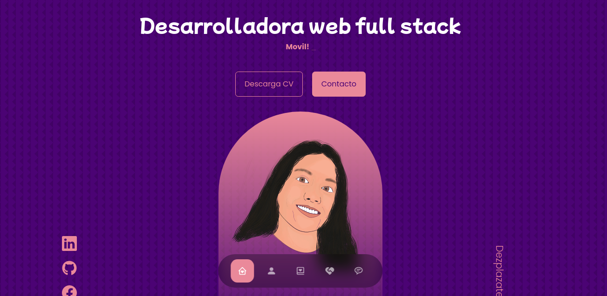
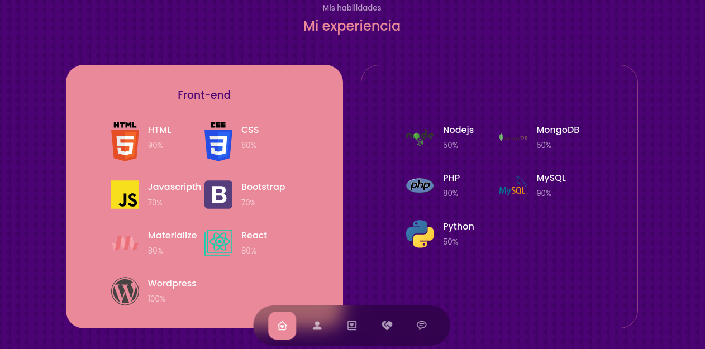
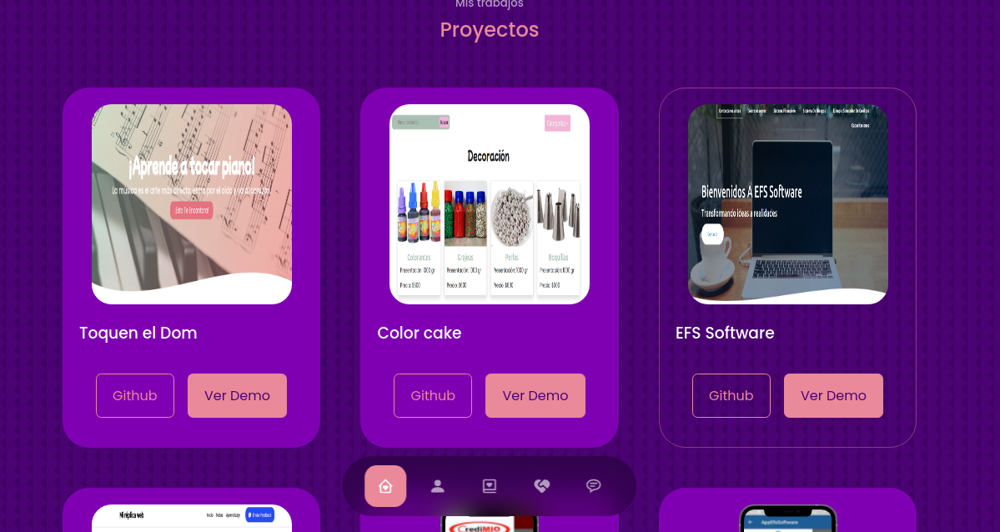

<h1>Portafolio</h1>

<em> Educamás -> <a href="https://educamas.com.co/">Programate</a> Cohorte IV REEDOM DEVELOPER. 💻  
</em>

Crearemos nuestro portafolio online haciendo uso de HTML, CSS , JAVASCRIPT y REACT.

⚙️ Technologies

☕️  HTML
 
☕️  css
 
☕️  React

⚙️ Deploy available: https://daniela8896.github.io/portafolio/

<h3>Landing Page</h3>

<h3>Add Appoitnment</h3>

<h3>Administrator view</h3>

